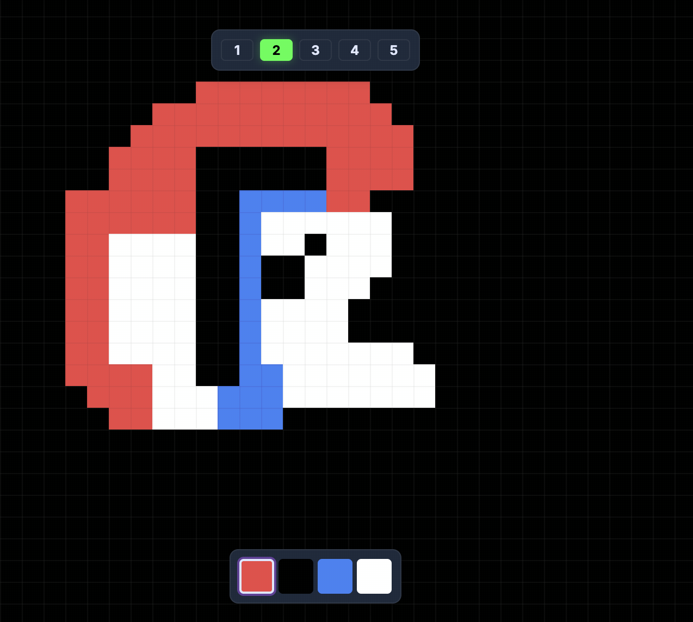
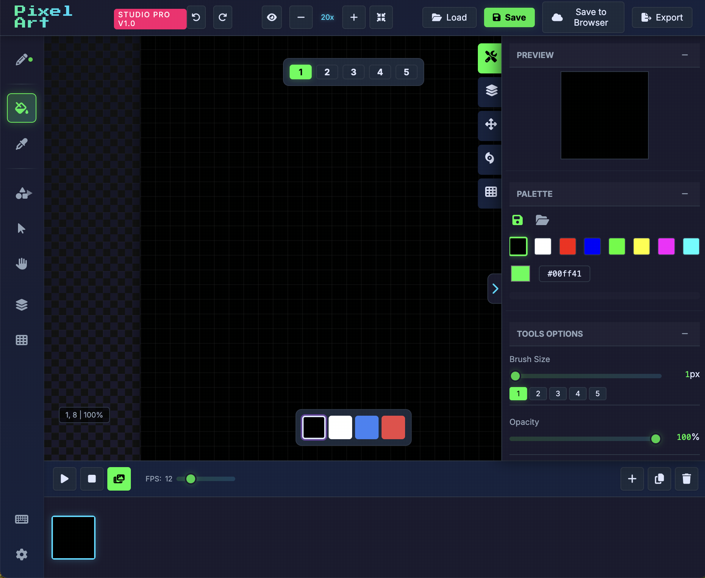
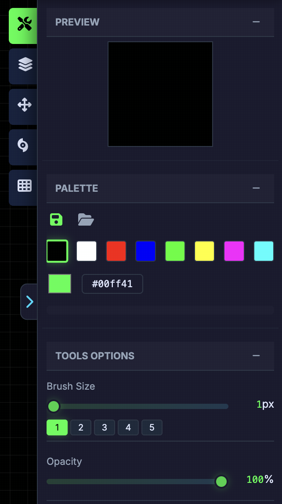
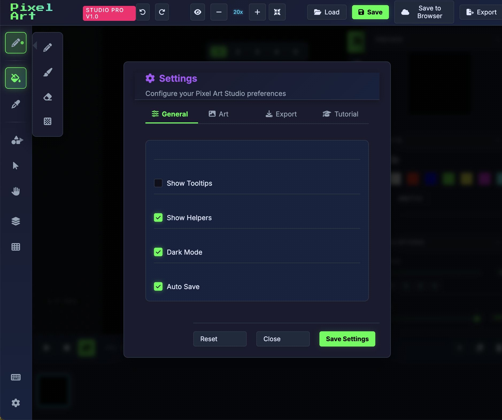

# Pixel Art Studio Pro


A comprehensive, browser-based pixel art creation studio with advanced features for artists, game developers, and pixel art enthusiasts. Create stunning pixel art, animations, and tilemaps with professional-grade tools right in your browser.

## ✨ Features

### 🎨 Drawing Tools


- **Pencil Tool** (P) - Precise pixel placement
- **Brush Tool** (B) - Variable size and opacity
- **Eraser Tool** (E) - Remove pixels with different modes
- **Fill Bucket** (F) - Flood fill with color
- **Mirror Tool** (X) - Symmetrical drawing with customizable axes
- **Dither Tool** (D) - Create texture patterns
- **Eyedropper** (I) - Pick colors from canvas
- **Move Tool** (M) - Pan around the canvas

### 📐 Shape Tools


- **Line Tool** (L) - Draw straight lines
- **Rectangle Tool** (R) - Create rectangles and squares
- **Circle Tool** (C) - Draw circles and ellipses

### 🎬 Animation System


- **Timeline Editor** - Frame-by-frame animation creation
- **Variable FPS Control** - 1-60 FPS playback speed
- **Frame Management** - Add, duplicate, delete frames
- **Real-time Preview** - See your animation come to life
- **Up to 100 Frames** - Support for complex animations

### 🎭 Layer System


- **Multi-layer Support** - Work with multiple layers simultaneously
- **Layer Visibility Toggle** - Show/hide individual layers
- **Layer Ordering** - Rearrange layer hierarchy
- **Blend Modes** - Combine layers with different effects

### 🎨 Color Management


- **Advanced Color Picker** - Precise color selection
- **Custom Palettes** - Save and import color palettes
- **Palette Import** - Support for popular palette formats
- **Recently Used Colors** - Quick access to frequently used colors
- **Hex Color Support** - Direct hex value input

### 🔧 Advanced Features

#### Filter System

- Apply various visual effects to your artwork
- Real-time preview of filter results
- Non-destructive filter application

#### Tilemap Editor

- **Seamless Grid Mode** - Preview tile repetition
- **Edge Wrapping** - Drawing near edges wraps to opposite side
- **Tile Preview** - Visual tilemap grid system
- **3x3 Tiling** - See how tiles repeat around your canvas

#### Canvas Controls

- **Zoom System** - 1x to 20x zoom levels
- **Grid Overlay** - Toggle grid visibility
- **Snap to Grid** - Precise pixel placement
- **Coordinate Display** - Real-time cursor position
- **Minimap** - Navigate large canvases easily

## 🚀 Getting Started

### Quick Start
1. Open `index.html` in your browser
2. Select a drawing tool from the left toolbar
3. Choose your color from the color picker
4. Start drawing on the canvas!

### Keyboard Shortcuts


| Key | Action |
|-----|--------|
| `P` | Pencil Tool |
| `B` | Brush Tool |
| `E` | Eraser Tool |
| `F` | Fill Bucket |
| `D` | Dither Tool |
| `X` | Mirror Tool |
| `I` | Eyedropper |
| `M` | Move Tool |
| `L` | Line Tool |
| `R` | Rectangle Tool |
| `C` | Circle Tool |
| `Space` | Play/Stop Animation |
| `Ctrl+S` | Save Project |
| `Ctrl+O` | Load Project |
| `Ctrl+Z` | Undo |
| `Ctrl+Y` | Redo |
| `+` / `-` | Zoom In/Out |
| `0` | Reset Zoom |

### File Operations


- **Save Project** - Export your work as a JSON file
- **Load Project** - Import previously saved projects
- **Export Sheet** - Generate sprite sheets for game development
- **Browser Storage** - Save directly to your browser

## 🎯 Use Cases

### Game Development

- Create sprite sheets for 2D games
- Design character animations
- Build tile sets and backgrounds
- Prototype game graphics quickly

### Pixel Art Creation

- Portrait and character art
- Landscape and environment design
- Retro-style illustrations
- Icon and UI element creation

### Animation Projects

- Animated sprites and characters
- Loopable animations
- Pixel art sequences
- Web animations

## 🛠️ Technical Details

### Browser Compatibility
- ✅ Chrome (recommended)
- ✅ Firefox
- ✅ Safari
- ✅ Edge

### Performance
- Optimized canvas rendering
- Efficient memory management
- Smooth 60 FPS playback
- Responsive interface

### File Formats
- **Input**: JSON project files, ASE palette files
- **Output**: JSON projects, PNG sprite sheets
- **Browser Storage**: LocalStorage for auto-save

## 📁 Project Structure

```
pixelArt-main/
├── index.html              # Main application interface
├── css/
│   └── styles.css          # Application styling
├── js/
│   ├── app.js              # Application initialization
│   ├── config.js           # Configuration constants
│   ├── canvas-manager.js   # Canvas operations
│   ├── tool-manager.js     # Drawing tools
│   ├── layer-manager.js    # Layer system
│   ├── animation-manager.js # Animation system
│   ├── color-manager.js    # Color management
│   ├── filter-manager.js   # Filter effects
│   ├── tilemap-manager.js  # Tilemap editor
│   ├── file-manager.js     # File operations
│   ├── ui-manager.js       # User interface
│   ├── input-handler.js    # Input processing
│   ├── dom.js              # DOM manipulation
│   ├── state.js            # Application state
│   └── vender/
│       └── all.js          # External libraries
└── README.md               # This file
```

## 🎨 Features Gallery

### Workspace Layout


The interface is divided into logical sections:
- **Left Toolbar**: Drawing and shape tools
- **Center Canvas**: Main drawing area with zoom controls
- **Right Panel**: Color palette, layers, filters, and settings
- **Timeline**: Animation frame management
- **Header**: File operations and zoom controls

### Tool Options


Customize your tools with:
- **Brush Size** - 1-20 pixel range with presets
- **Opacity Control** - 0-100% transparency
- **Blur Effect** - Soft brush edges
- **Mirror Axes** - Horizontal, vertical, or both

### Settings Panel


Configure your workspace:
- Canvas size (4x4 to 128x128 pixels)
- Grid visibility and snap
- Minimap toggle
- Coordinate display
- Dark mode
- Auto-save preferences

## 🔮 Future Enhancements

- [ ] Color gradient tool
- [ ] Text tool with pixel fonts
- [ ] Selection tool with magic wand
- [ ] More filter effects
- [ ] Layer blend modes
- [ ] Animation onion skinning
- [ ] Collaborative editing
- [ ] Cloud storage integration

## 📝 License

This project is open source and available under the [MIT License](LICENSE).

## 🤝 Contributing

Contributions are welcome! Please feel free to submit pull requests or open issues for bugs and feature requests.

## 📞 Support

If you encounter any issues or have questions, please open an issue on the project repository.

---

**Pixel Art Studio Pro** - Create amazing pixel art in your browser! 🎨✨